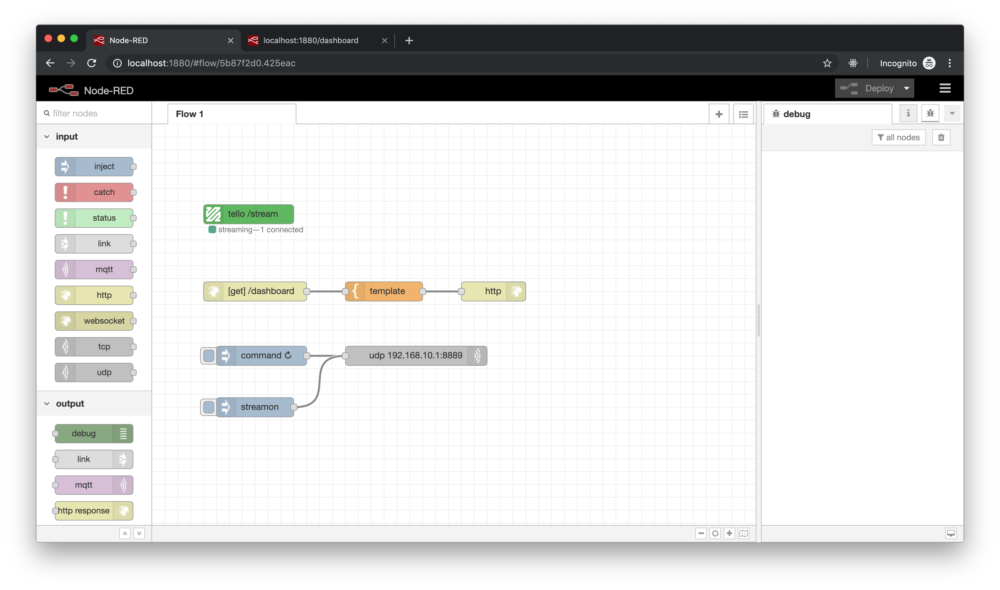
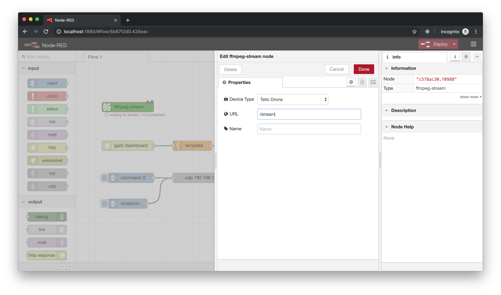

# node-red-contrib-ffmpeg
[](https://npmjs.org/package/node-red-contrib-ffmpeg)
[](https://npmjs.org/package/node-red-contrib-ffmpeg)

A simple ffmpeg wrapper for streaming video.



## Installation
```
$ npm install node-red-contrib-custom-ffmpeg-video
```

> **Note:** This node requires that you have [ffmpeg](https://ffmpeg.org/) installed on your machine.

## Configure your node
Open the node's configuration panel to set `Input URL` and the `Stream URL`.

> **Note:** In this example our stream will be accessible at `ws://<host>:<port>/stream`

## Using the stream
To render the video stream in the browser, we use a library called [JSMpeg](https://github.com/phoboslab/jsmpeg).
```html
<html>
  <body>
    <!-- import JSMpeg -->
    <script src="jsmpeg.min.js"></script>
    <!-- create a canvas tag to render our video stream -->
    <canvas id="video-canvas"></canvas>
    <script>
      const videoCanvas = document.getElementById('video-canvas')
      
      // The stream URL that we set in the previous step.
      const url = `ws://${window.location.hostname}:${window.location.port}/stream`

      new JSMpeg.Player(url, { canvas: videoCanvas })
    </script>
  </body>
</html>
```

## Device specific instructions
There are a few minor hardware specific steps depending on your device.

```
sudo raspi-config
```

